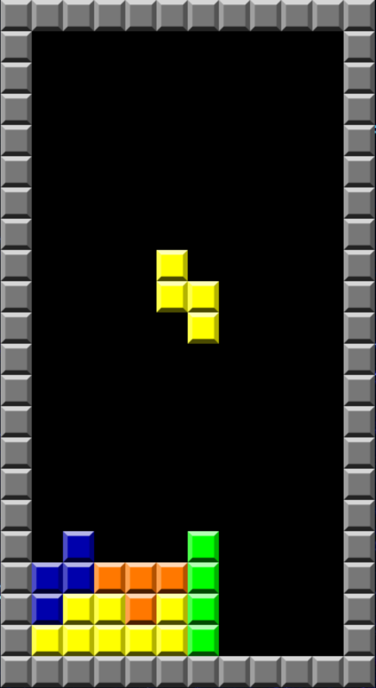

# Projeto Modulo 1 IronHack DevWeb 
## TETRIS

O projeto é uma tentativa, espero que bem sucedida de clonar o jogo russo famoso: TETRIS. O jogo tem controles alternados entre W,A,S,D e as setas, ele pode ser jogado [**AQUI**](https://igorgalvaob.github.io/ProjetoModulo1/).

### Funcionalidades
O jogo inclui audio e um pequeno efeito quando a linha é limpa, carece de maiores implementações, as quais darei atenção em futuro próximo.
